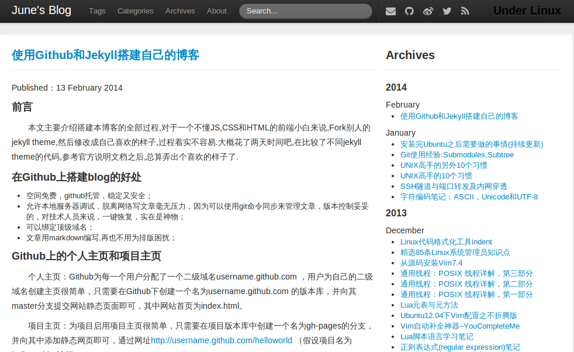

#TramiDu的个人博客

这是一个使用Jekyll Bootstrap自带的Twitter主题搭建的个人博客,在Twitter Theme基础上添加多说评论系统,Jiathis,Google search,Google Analystics,Font-awesome等.



##使用方法

###1.获取源码

     

###2.修改_config.yml

主题中我添加的源码部分基本都是softcode的,一般修改配置文件\_config.yml即可,修改内容如下:

* title:博客标题
* tagline:标签行
* favicon:图片
* author部分:个人信息
* production_url:现在仅在RSS中用到,改为自己的博客地址
* comments部分:设置comments helper
* analytics部分:设置analytics helper

###3.域名绑定

将CNAME文件下的域名修改为需要绑定的域名地址,绑定一级,二级域名均可.

###4.本地调试

将自己的博文Copy到`_post`目录下,运行 ```jekyll server```，浏览器打开 http://localhost:4000 便可以看到修改后的主题,

##Author


